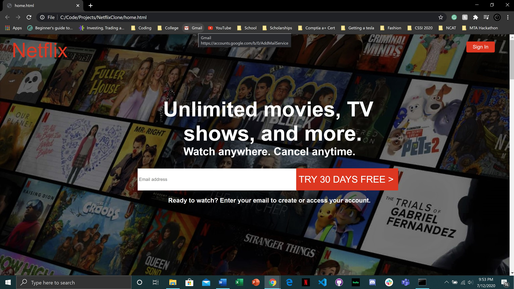
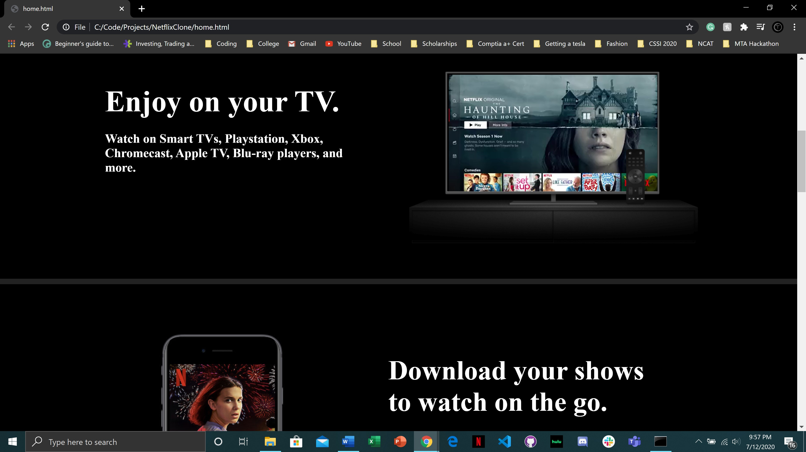
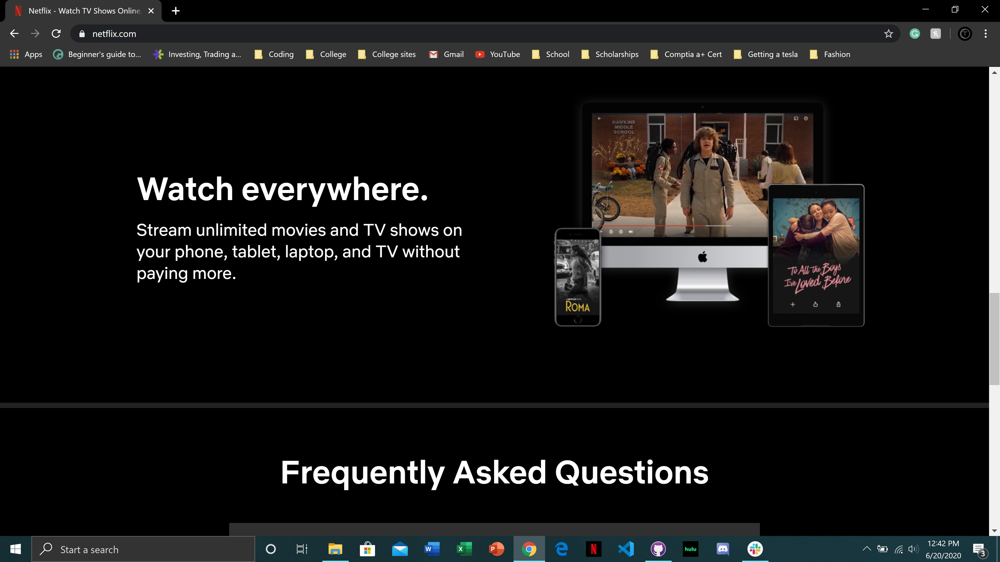
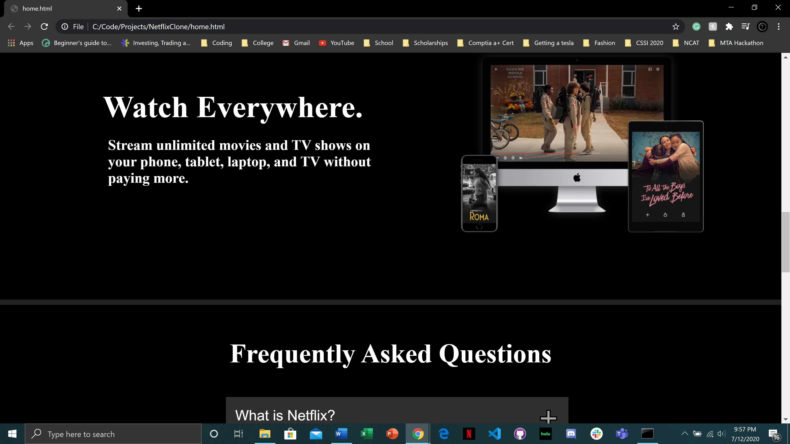
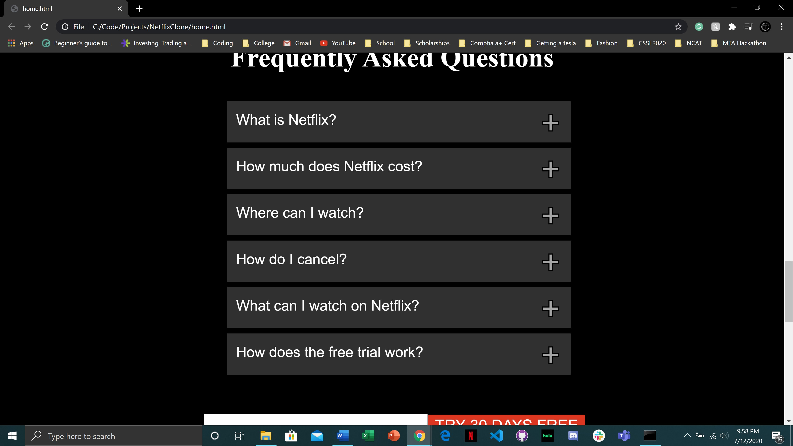
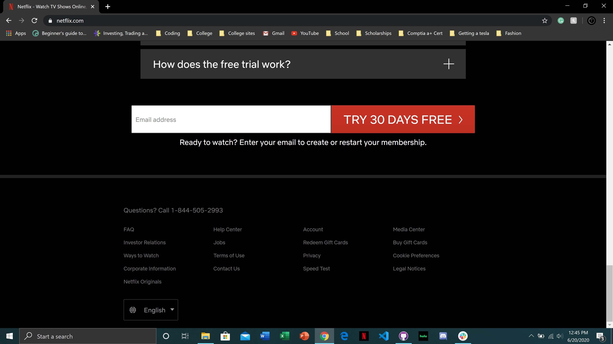
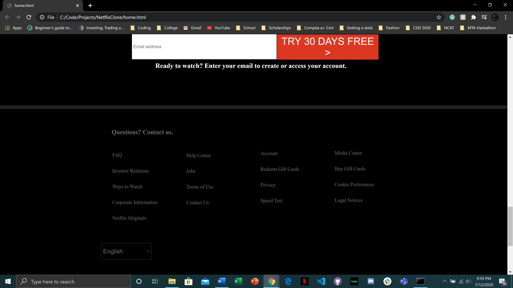

# NetflixClone
### Using HTML5 and CSS3 I was able to make a clone of Netflix' landing page. 
[Original Netflix Page](https://www.netflix.com/)

## Images Below

### Real Netflix page

### My Netflix page

### Real Netflix page

### My Netflix page

### Real Netflix page

### My Netflix page

### Real Netflix page

### My Netflix page

### Real Netflix page

### My Netflix page

